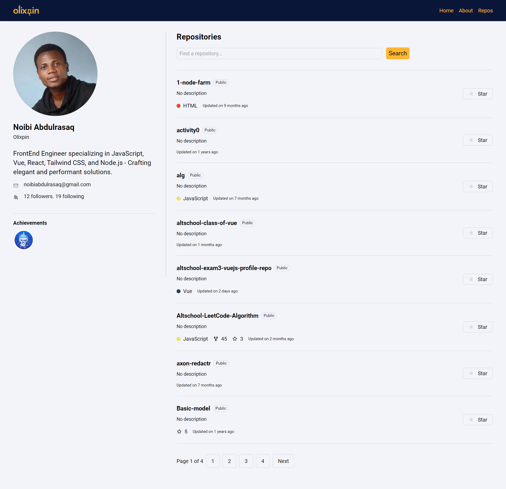

# Altschool 3rd Semester Exam

## Overview

Create a new Vue.js application.
Fetch GitHub repositories using the following endpoint:
Create a page to display a list of all the user's repositories on GitHub. The page should have pagination functionality.
Create another page to display data for a single repository clicked from the list of repositories using nested routes.
Implement a wildcard route to handle 404 pages.
Ensure that the UI and design of the pages are aesthetically pleasing and user-friendly.



## Hosted Link

<https://altschool-exam3-vuejs-profile-repo.vercel.app//>

## API Endpoint

<https://api.github.com/users/USERNAME/repos>

## Requirements

- Use Vue.js
- Use Vue Router

## Other Tools Used

- Axios
- Tailwind CSS
- Vue CLI

## Project setup

```
npm install
```

### Compiles and hot-reloads for development

```
npm run dev
```

### Compiles and minifies for production

```
npm run build
```
